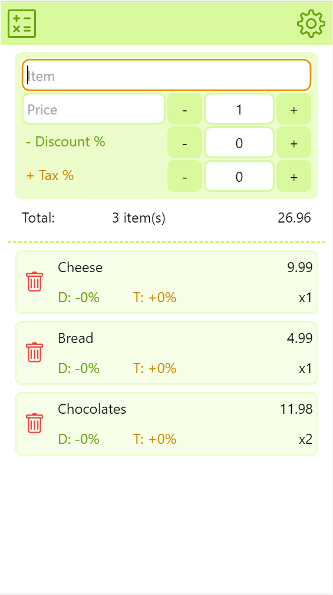

## Cart calculator
https://cart-calculator.vercel.app/

Browser application that helps you control your expenses during shopping.

## Settings

#### Base discount & Base tax percents

They are applied as default discount and tax values for every new item in the cart.

#### Currencies - rates and symbols

Primary currency rate is always set to 1 as it is used for calculations.

Secondary currency rate is 0 by default and is not visible in the cart. When the rate is set, it becomes visible alongside with primary currency. The rate can be set with .0000 accuracy and is calculated as '1 primary currency costs X secondary currency'.

Example:

Assuming we calculate our cart in USD ($), we want to have our secondary prices in EUR (€). We must check the USD ($) rate to EUR (€) and set the secondary rate accordingly.

- primary currency - 1 (default)
- secondary currency - 0.92 (set)

Symbols can be set for both currencies for better visuals. Symbols support up to 3 characters, so it can be set as '$' or 'USD'.

